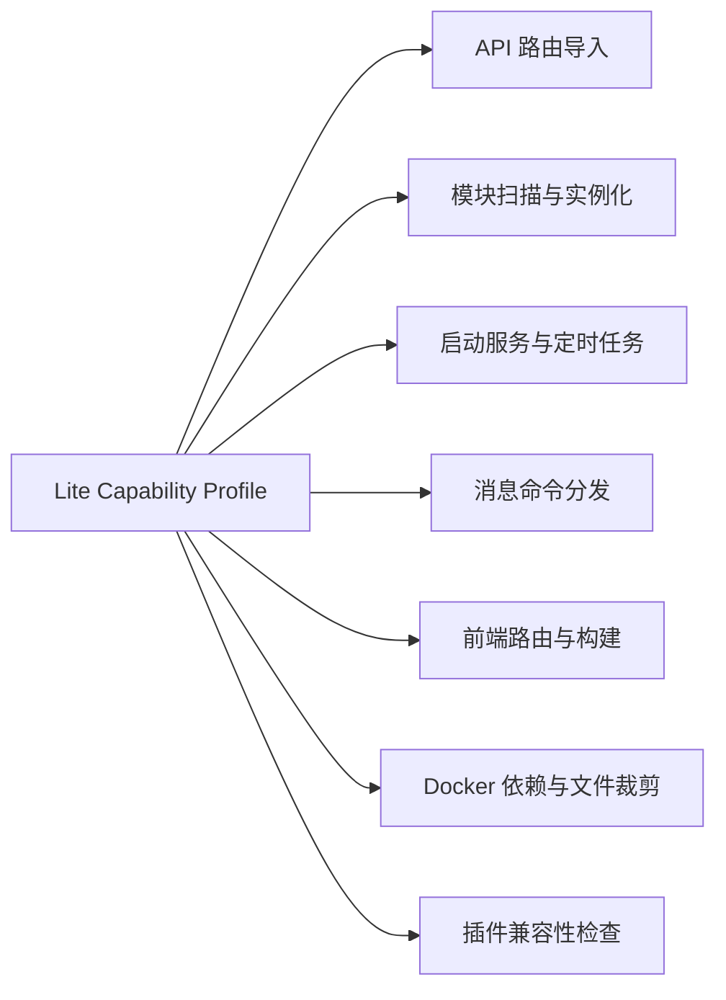

# MoviePilot Lite 架构

## 1. 文档目的

本文档定义 MoviePilot Lite 的稳定架构边界，包括能力裁剪、运行时组合、前后端一致性、插件兼容、数据兼容和构建产物要求。

MoviePilot Lite 继续遵守官方 `docs/rules/05-architecture.md` 规定的分层结构和依赖方向。产品范围、保留能力和移除能力以根目录 `PROJECT_BRIEF.md` 为准；每项具体改动的实施步骤和验收场景后续通过 OpenSpec 管理。

## 2. 架构目标

- Lite 是固定的精简构建，不是通过隐藏菜单模拟的运行模式。
- 已移除能力不得被导入、注册、实例化、调度或打包。
- 前端、后端、插件检查和 Docker 构建必须使用同一份能力定义。
- 尽量保留官方源码结构和提交历史，控制长期上游合并成本。
- 保留官方 `/config` 数据目录的迁移和回退能力。
- 所有裁剪必须可以通过功能测试和资源指标验证。

## 3. 固定能力配置

Lite 使用唯一、不可由普通运行配置改写的能力配置。能力定义应满足以下约束：

- 使用 `Capability` 表达稳定的能力标识。
- 使用固定的 `LITE_CAPABILITIES` 启用列表表达 Lite 构建范围。
- 能力定义不得导入业务模块、数据库、插件或外部服务。
- 能力配置必须在 API、模块和启动服务导入之前可用。
- PT、下载器、订阅、Agent 等已移除能力不能通过环境变量或用户设置重新开启。
- 前端构建清单由同一份能力定义生成，不得人工维护第二份启用列表。

能力定义落在 `app/core/capability.py`，由 `Capability`、固定的
`LITE_CAPABILITIES`、派生的 `LITE_DISABLED_CAPABILITIES`、
`is_capability_enabled()` 和 `get_lite_capability_manifest()` 共同组成。
机器清单固定输出配置名称、配置版本以及排序后的启用和禁用能力列表。
当前能力配置版本为 2；`auxiliary-auth` 明确归入禁用集合，用于辅助认证、MFA 和 PassKey 路由，且不影响管理员密码登录、`API_TOKEN` 或 115 OAuth/API。

API 路由门控已经消费该配置：主 API 和独立兼容接口必须先检查能力，再导入对应端点模块。PT 用户认证运行链路也已完成首批裁剪：`AUTH_SITE` 不再生效，管理员认证上下文固定为本地等级 1，插件等级 2、3、99 不再通过在线认证或私钥提升，启动阶段不再初始化站点认证/索引资源，Scheduler 不再注册 CookieCloud 同步、用户认证检查和站点数据刷新任务，也不清理历史站点用户数据。

模块发现已经完成两层导入前门控。顶层无条件保留 Bangumi、豆瓣、Fanart、FileManager、TMDB、TVDB；官方消息渠道和 Emby/Jellyfin/Plex 只按启用配置加载；PT、下载器、Redis、PostgreSQL、非目标媒体服务器及未知上游包默认拒绝。FileManager 始终保留 Local，U115、Alipan、Alist、Rclone、SMB 只在已配置或经过既有认证入口明确首次设置时精确加载。Notifications、MediaServers、Storages 集合变化由 ModuleManager 统一重建，避免服务模块重复初始化。生命周期、Scheduler、Command、MessageChain、Monitor 与 TransferChain 也已完成固定集合和导入隔离；依赖、Docker 和前端门控仍由后续 OpenSpec 分阶段实施，不得因当前裁剪而宣称完整 Lite 已经完成。

## 4. 能力门控



能力未启用时，系统必须同时满足以下条件：

- 不导入对应 Python 或前端业务模块。
- 不注册对应 API、前端路由或消息动作。
- 不创建对应服务、模块实例、线程或后台任务。
- 不注册对应定时任务、事件处理器或监控器。
- 不安装只服务于该能力的运行依赖。
- 不把对应页面、资源和专属代码打入 Lite 运行镜像。
- 不允许插件绕过能力门控恢复已移除能力。

任何只隐藏菜单、但仍在后台导入或运行相关功能的实现均不符合 Lite 架构。

## 5. 官方分层保持不变

Lite 不引入新的业务分层，继续遵循官方调用方向：

```text
API / 消息入口 / 调度入口
  → Chain 业务编排
    → Module / Helper / DB Oper
```

### 5.1 入口层

API、消息和调度入口只负责身份认证、权限判断、参数解析和响应适配。跨模块业务流程必须进入 Chain 层。

### 5.2 Chain 层

`app/chain/` 负责网盘转存、元数据识别、文件整理、通知和媒体服务器刷新等业务编排。115 分享链接处理应由消息入口完成官方权限判断后交给 Chain，Chain 再协调插件管理和后续整理流程。

### 5.3 Module 层

`app/modules/` 保留网盘存储、元数据、消息渠道和媒体服务器适配器。新代码不得建立模块到模块的直接依赖，也不得扩大历史遗留的模块到 Chain 反向依赖。

### 5.4 Helper 层

`app/helper/` 只保存跨多个调用方复用的底层工具。完整的网盘转存或整理工作流不得放入 Helper。

### 5.5 DB / Oper 层

数据库继续通过 `app/db/*_oper.py` 访问。Chain、Module 和 Endpoint 不得直接执行 SQLAlchemy 查询；数据库结构变化必须提供 Alembic 迁移。

## 6. 后端裁剪边界

| 裁剪位置 | Lite 规则 |
|---|---|
| API 路由 | 检查能力后再动态导入，只注册保留接口 |
| 模块加载 | 在导入模块包之前按允许列表过滤，不得先导入再判断 |
| 生命周期 | 未启用的初始化器不得导入或执行 |
| 定时任务 | 只注册网盘、整理、插件及必要维护任务 |
| 消息命令 | 保留官方身份与权限逻辑，裁掉 PT、下载、订阅和 Agent 动作 |
| 外部服务 | 不初始化站点认证、Redis、浏览器内核、工作流或 Agent 服务 |
| 依赖安装 | Lite 使用独立依赖入口，不安装已移除能力的专属依赖 |
| Docker 构建 | 构建产物排除无用依赖、代码、资源和前端页面 |

当前运行时固定矩阵如下：

| 入口 | 固定保留集合 |
|---|---|
| 启动 owner | Router、ModuleManager、EventManager、已安装插件、Lite Scheduler、Monitor、Lite Command；DoH 仅在启用时加载 |
| 系统定时任务 | `scheduler_job`、`clear_cache`；存在已启用媒体服务器时加入 `mediaserver_sync`，按设置加入 `data_cleanup`、`full_gc`；兼容插件任务继续注册 |
| 内建命令 | `/mediaserver_sync`、`/clear_cache`、`/restart`、`/version`；兼容插件命令继续注册 |
| 普通消息 | 保留渠道身份、插件输入与回调、固定命令、通知、`UserMessage` 和 `MessageAction`；115 分享链接原样交给插件消费者 |

启动完成任务只写入本地系统状态并结束重启标记，不自动同步插件、不安装缺失依赖、不刷新插件市场、不启动 Workflow 或 Agent，也不发送使用统计。禁用或未知 Scheduler ID 明确返回失败，不能借手动运行接口临时恢复历史任务。

`ModuleHelper.load()` 同时支持包级预过滤和导入后的类过滤；ModuleManager 与 FileManager 必须使用前者在 `import_module()` 之前完成固定白名单判断。产品能力映射保留在组合根，通用 Helper 不读取数据库或 Lite taxonomy。运行中停用适配器时必须停止活动实例，但不通过删除 `sys.modules` 强制卸载共享代码；重启后按最新配置形成干净导入集合。

## 7. 前端边界

- 前端构建使用后端能力定义生成的构建清单。
- 未启用能力的页面不得进入路由表、菜单或最终构建产物。
- 后端仍须拒绝未启用接口，不能把前端隐藏作为安全边界。
- 保留登录、文件管理、文件整理、整理历史、插件、消息通知、媒体服务器以及必要设置页面。
- 前端不得独立定义另一份功能移除清单。
- 前后端构建必须记录相同的能力配置版本，版本不匹配时应明确报错。

## 8. 115 分享链接流程

```text
官方消息渠道接收分享链接
  → 使用官方身份和权限规则完成校验
  → Lite 消息入口识别 115 分享链接
  → Chain 调用用户手动安装的 P115StrmHelper
  → 插件完成转存并触发后续 STRM 或整理流程
  → 原消息渠道返回处理结果
```

该流程必须遵守以下边界：

- 不新增或重写消息渠道的全局权限模型。
- Lite 核心不得预装、自动安装或后台下载 P115StrmHelper。
- 插件缺失或未启用时，系统仍可正常启动。
- 插件不可用时，相关入口必须明确说明需要手动安装并启用 P115StrmHelper。
- 115 Chain 可以通过官方插件管理能力调用插件，但网盘 Module 不得直接依赖插件。

## 9. 插件兼容边界

- 保留官方插件市场、手动安装、升级、页面、事件、定时任务和插件 API。
- 插件导入或启用前必须完成能力兼容检查。
- 依赖 PT、站点、下载器、订阅、Agent、Redis、工作流或 `ffmpeg` 的插件必须阻止运行，并显示具体缺失能力。
- P115StrmHelper 是明确支持和验收的插件，但仍由用户手动安装。
- 未经兼容测试的其他插件不得标记为受支持。
- 不得为了兼容单个插件恢复已经从 Lite 移除的完整核心能力。

## 10. 数据与配置兼容

- 正式运行只支持 SQLite 和进程内缓存。
- 保留官方 `/config` 目录结构、必要配置名称和数据路径。
- 不主动删除已移除模块留下的表、配置项、历史记录或未知字段。
- 首次使用官方 `/config` 启动 Lite 前必须备份数据库和关键配置。
- Lite 数据变更不得阻止用户回退到对应的官方版本。
- 真实网盘令牌、消息令牌、Cookie、密码和 `API_TOKEN` 不得进入源码或普通 CI。

## 11. 构建与资源边界

- Docker 支持 `linux/amd64` 和 `linux/arm64`。
- Lite 构建不得安装 PT、下载器、Agent、浏览器内核、PostgreSQL、Redis、工作流和 `ffmpeg` 的专属依赖。
- 保留 `ffprobe`，用于视频信息读取和识别整理。
- Git 仓库可保留必要的官方源码结构以降低合并成本，但 Lite 运行镜像必须排除未启用能力的文件和资源。
- 未启用网盘监控时不得产生周期性网盘扫描。
- 不得运行站点、订阅、下载器、Agent 或工作流轮询。

资源验收基于相同设备、相同官方版本和等价配置：

- 空闲常驻内存至少降低 30%。
- Docker 镜像体积至少降低 25%。
- 冷启动时间至少缩短 20%。
- 空闲 CPU 长期接近 0。

## 12. 禁止的实现方式

- 只隐藏前端入口，后端仍导入并运行对应能力。
- 在前端和后端分别维护功能清单。
- 先导入全部模块，再通过配置关闭实例。
- 通过捕获导入异常掩盖依赖仍然存在的问题。
- 直接大规模删除官方源码，导致上游同步长期失控。
- 模块之间直接调用，或让 Helper 承担完整业务工作流。
- 为兼容插件而静默恢复已移除能力。
- 自动删除官方配置或数据库中的旧数据。

## 13. 实施约束

本文档只规定稳定架构，不作为具体任务清单。每项实现必须：

1. 通过对应 OpenSpec 明确变更范围、兼容影响和验收场景。
2. 遵循官方命名、分层、设计模式和中文 docstring 规范。
3. 提供能够证明未导入、未注册、未运行目标能力的测试。
4. 记录对资源指标和上游同步补丁规模的影响。
5. 按 `AGENTS.md` 的分步审批规则获得用户确认后执行。
